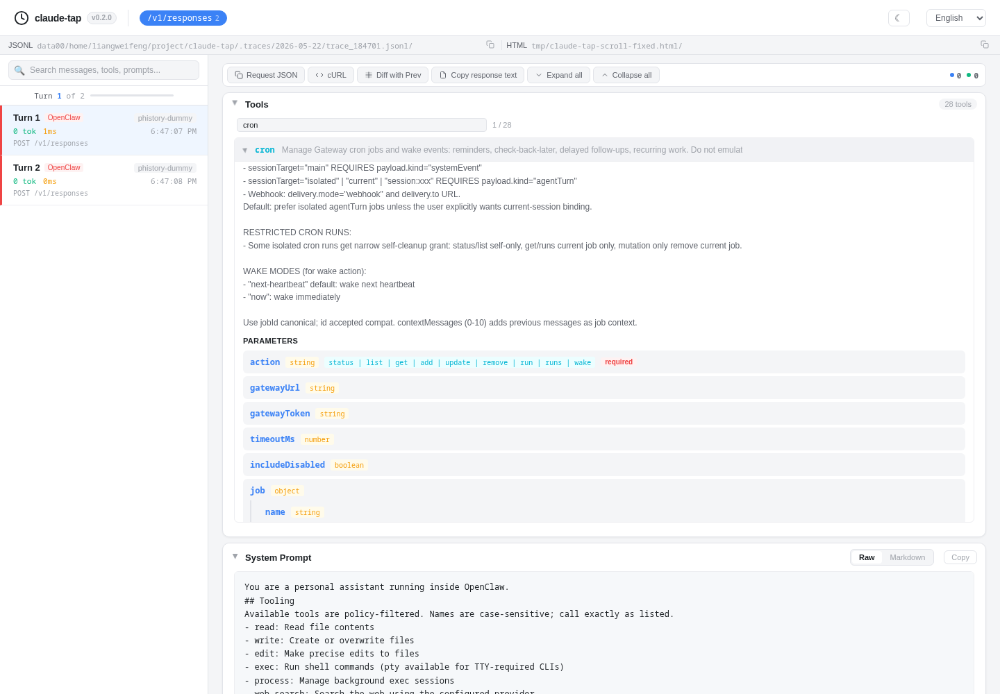

# Long viewer blocks had no local scroll

## Symptom

Expanded tool definitions could grow to several thousand pixels tall. Long
plain-text messages and the rendered system-prompt view had the same behavior,
forcing users to scroll the entire detail page to get past one block.

## Cause

Raw text, JSON, and tool-call payloads already had height limits, but expanded
tool schemas, readable text items, and rendered Markdown did not. In the tool
case, the CSS comment even described an internal scrolling area that had never
been implemented.

## Fix

Bound only the content areas that can become unusually tall and let them scroll
internally when needed. Short content keeps its natural height. Tool details are
limited to 520 px, readable text to 480 px, and rendered Markdown to 500 px.

Validation used a real 6,960 px OpenClaw tool definition, a 10,426 px rendered
system prompt, and a synthetic 18,000 px response. All three kept their expected
height and exposed local vertical scrolling.

